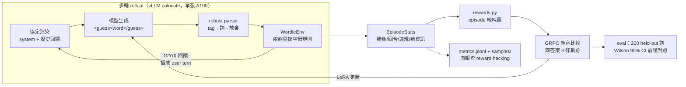

# agentic-rl-wordle — 多輪 GRPO 訓練 Wordle Agent

用**多輪 GRPO** 把 `Qwen/Qwen2.5-1.5B-Instruct` 訓練成會玩 Wordle 的 agent：
模型每回合輸出 `<guess>word</guess>`，環境回傳 G/Y/X 回饋插成 user turn，最多 6 回合，
猜中才有大獎勵。零標註、零 API 費——獎勵全部程式可驗證。

> **prompt agent vs 訓練 agent**：市面上大多數「agent」是 prompt 工程——把規則、
> 範例、修正全部塞進越疊越長的 system prompt，模型本身沒有變。這個專案走另一條路：
> 讓 agent 在環境裡**自己玩幾千局**，用 GRPO 把「讀懂回饋 → 收斂猜測」的策略
> **寫進權重**。prompt 固定不變，變強的是模型。這正是 2026 年 agentic RL
> （多輪 rollout + episode 級獎勵 + 組內相對優勢）的最小可信示範。

## 架構



- **assistant-only loss（結構性）**：只有模型生成的 token 進 completion_ids，
  環境回饋只存在於重新渲染的 prompt 側——不依賴 chat template 的 mask 支援。
- **同組同答案**：GRPO 的 8 條軌跡共享同一個隱藏答案（rollout 內 seeded sampler），
  組內優勢比較才有意義。
- **TRL 接觸面隔離**：實驗性 API 全部關在 `src/wordle_rl/rollout.py`——
  換 ART 備援 = 換一個模組（選型分析見 [docs/decision.md](docs/decision.md)）。

## 四階段流程（每階段數字真實落地才進下一階段）

| 階段 | 內容 | Gate | 狀態 |
|---|---|---|---|
| 0 | 環境 + 協定 + 線索追蹤（純 CPU） | pytest 全綠（重複字母 14 案預驗證表） | ✅ 110+ tests |
| 1 | 三條 baseline（200 個 held-out 詞） | results/baselines.md 真實數字 | ✅ random/heuristic；LLM 待 Colab |
| 2 | 選型 spike + 猜數字煙霧訓練 | 20–30 分鐘內學習曲線上升 | ⬜ Colab |
| 3 | Wordle 正式訓練（A100 過夜）+ 前後對照評測 | 勝率顯著超過未訓練 baseline（CI 佐證） | ⬜ Colab |

## 目前成果（真實執行；勝率附 Wilson 95% CI）

| agent | 勝率 [95% CI] | 勝局均猜 | 非法輸出率 | 重用已排除字母 | 破壞已知綠位 |
|---|---|---|---|---|---|
| random（12,972 合法詞均勻抽） | 0.0% [0.0, 1.9] | — | 0.0% | 87.4% | 57.8% |
| heuristic（位置頻率 + 線索過濾）※ | **99.5% [97.2, 99.9]** | 3.56 | 0.0% | 0.0% | 0.0% |
| qwen2.5-1.5b-instruct（未訓練） | ⬜ 待 Colab | | | | |
| qwen2.5-1.5b **+ GRPO LoRA** | ⬜ 待訓練 | | | | |

※ heuristic 看得到完整答案表（Wordle solver 常規），是參照上界、不是公平對手。
完整表與逐局記錄：[results/baselines.md](results/baselines.md)。
成功判準（紅線）：訓練後**勝率顯著超過未訓練 baseline**＋格式錯誤率塌陷＋違限率下降；
達不到就如實寫進限制並分析原因。

## 重現步驟

```bash
# 階段 0：環境（本機，純 CPU）
python scripts/fetch_words.py        # 抓公開單字表（來源見下）
pip install -e . pytest && pytest    # 全綠才前進

# 階段 1：baseline
python baselines/run_baseline.py --agent random
python baselines/run_baseline.py --agent heuristic
python baselines/run_baseline.py --agent llm --backend vllm   # GPU（Colab）

# 階段 2/3：訓練（Colab A100）
python scripts/make_colab_bundle.py  # 打包原始碼 → 上傳 Drive/agentic-rl-wordle/
# 開 wordle_grpo_colab_train.ipynb：SMOKE_TEST=True 跑煙霧 → 過 gate 後 False 跑正式（背景執行）

# 評測與觀戰
python eval/run_eval.py --adapter runs/full/final --backend vllm
python play.py --answer crane --adapter runs/full/final
```

## 單字表來源

由 `scripts/fetch_words.py` 於安裝時下載（不入 git；`data/SOURCE.json` 記錄 URL 與 sha256）：

- 答案 2,315 詞：[cfreshman/wordle-answers-alphabetical](https://gist.github.com/cfreshman/a03ef2cba789d8cf00c08f767e0fad7b)
- 額外合法猜測 10,657 詞：[cfreshman/wordle-allowed-guesses](https://gist.github.com/cfreshman/cdcdf777450c5b5301e439061d29694c)
  （合法集 = 聯集 12,972）
- 備援（僅合法集側）：[tabatkins/wordle-list](https://github.com/tabatkins/wordle-list)（MIT）

## 專案結構 / 文件

- [PLAN.md](PLAN.md)——完整 v1 計畫（含研究查證、設計決策表、里程碑 gate）
- [docs/decision.md](docs/decision.md)——訓練器選型（verifiers / ART / TRL）與來源
- [docs/rewards.md](docs/rewards.md)——獎勵量級論證與防 reward hacking 分析
- [docs/model_card.md](docs/model_card.md)——HF model card（訓練後回填數據）
- 產出模型：`steven0226/qwen2.5-1.5b-wordle-grpo`（LoRA）/ `…-merged` ⬜ 待訓練後 push

<!-- GitHub 發佈（暫緩，之後一鍵補上）：
gh repo create agentic-rl-wordle --public --source=. --push
gh repo edit --add-topic agentic-rl --add-topic grpo --add-topic multi-turn \
  --add-topic reinforcement-learning --add-topic wordle --add-topic qwen
-->

## License

Apache-2.0
