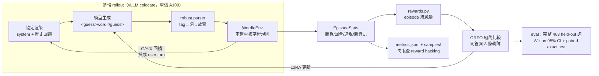

# agentic-rl-wordle — Learning the Protocol Before the Strategy

用**多輪 GRPO** 把 `Qwen/Qwen2.5-1.5B-Instruct` 訓練成會玩 Wordle 的 agent：
模型每回合輸出 `<guess>word</guess>`，環境回傳 G/Y/X 回饋插成 user turn，最多 6 回合，
猜中才有大獎勵。零標註、零 API 費——獎勵全部程式可驗證。

這不是「1.5B 模型被訓練成高勝率 Wordle solver」的故事，而是一個更有診斷價值的結果：
GRPO 先把完全無法互動的 base model，訓練成 **99.9% 遵循 tool-like protocol、99.8% 輸出合法**
的 agent。完整 463 詞 held-out 評測中，勝率由 0/463 提升至 13/463（2.8%，exact paired
McNemar `p=0.000244`）；但利用跨回合線索的策略仍只學到一部分。專案因此同時呈現
agentic RL 的統計成功、實務效果與能力邊界，而不是只展示 reward 曲線。

> **English TL;DR** — Multi-turn GRPO training turned a Qwen2.5-1.5B base model that produced
> no legal actions into an agent with **99.9% protocol adherence** and **99.8% legal actions**.
> On the complete fixed 463-word held-out split, wins improved from **0/463 to 13/463**
> (2.8%, paired exact McNemar `p=0.000244`). The task-success effect is statistically real but
> practically small: constraint tracking remains weak, which this repo documents explicitly.

> **prompt agent vs 訓練 agent**：市面上大多數「agent」是 prompt 工程——把規則、
> 範例、修正全部塞進越疊越長的 system prompt，模型本身沒有變。這個專案走另一條路：
> 讓 agent 在環境裡**自己玩幾千局**，用 GRPO 把「讀懂回饋 → 收斂猜測」的策略
> **寫進權重**。prompt 固定不變，變強的是模型。這正是 2026 年 agentic RL
> （多輪 rollout + episode 級獎勵 + 組內相對優勢）的最小可信示範。

## 架構



- **assistant-only loss（結構性）**：只有模型生成的 token 進 completion_ids，
  環境回饋只存在於重新渲染的 prompt 側——不依賴 chat template 的 mask 支援。
- **同組同答案**：GRPO 的 8 條軌跡共享同一個隱藏答案（rollout 內 seeded sampler），
  組內優勢比較才有意義。
- **TRL 接觸面隔離**：實驗性 API 全部關在 `src/wordle_rl/rollout.py`——
  換 ART 備援 = 換一個模組（選型分析見 [docs/decision.md](docs/decision.md)）。

## 四階段流程（每階段數字真實落地才進下一階段）

| 階段 | 內容 | Gate | 狀態 |
|---|---|---|---|
| 0 | 環境 + 協定 + 線索追蹤（純 CPU） | pytest 全綠（重複字母 14 案預驗證表） | ✅ 123 tests |
| 1 | 三條 baseline（200 個 held-out 詞） | results/baselines.md 真實數字 | ✅ 全部完成 |
| 2 | 選型 spike + 猜數字煙霧訓練 | 20–30 分鐘內學習曲線上升 | ✅ reward +49%（200 步） |
| 3 | Wordle 正式訓練（A100 80GB，3000 步）+ 前後對照評測 | 勝率顯著超過未訓練 baseline（CI 佐證） | ✅ 完整 463 詞評測通過 |

## 學習漏斗：模型實際學到了哪一層

| 能力層次 | 未訓練 base | GRPO LoRA | 判讀 |
|---|---:|---:|---|
| `<guess>…</guess>` protocol 遵循 | 0.0% | **99.9%** | 明確學會 |
| 合法動作率 | 0.0% | **99.8%** | 明確學會 |
| 不重用已排除字母 | 無合法動作，無法定義 | 41.5% | 只部分學會 |
| 保留已知綠位 | 無合法動作，無法定義 | 51.1% | 只部分學會 |
| 6 回合內獲勝 | 0/463 | **13/463（2.8%）** | 顯著但實務效果小 |

這個漏斗把「格式服從、合法行動、狀態追蹤、任務成功」拆開，避免用單一 reward 或 win rate
掩蓋模型究竟在哪一層停止學習。

## 最終成果（完整 463 詞；greedy；Wilson 95% CI）

| agent | 勝率 [95% CI] | 勝局均猜 | 非法輸出率 | tag 遵循率 | 重用 X / 破壞 G |
|---|---|---:|---:|---:|---:|
| qwen2.5-1.5b-instruct（未訓練） | 0.0% [0.0, 0.8] | — | 100.0% | 0.0% | — |
| qwen2.5-1.5b **+ GRPO LoRA** | **2.8% [1.6, 4.7]** | 4.08 | **0.2%** | **99.9%** | 58.5% / 48.9% |

完整報告與代表性對局：[results/full_463_report.md](results/full_463_report.md)；
可重現統計：[results/full_463_analysis.md](results/full_463_analysis.md)。
random / heuristic 的 200 詞參照上界仍保留在 [results/baselines.md](results/baselines.md)；
heuristic 看得到完整答案表，不是公平對手。

**紅線判讀（如實陳述）**：三項成功判準中——(1) **格式錯誤率塌陷 ✅**：未訓練 base 在此
協定下 100% 回合非法（一手合法棋都下不出來），訓練後 0.2%，tag 遵循率 0%→99.9%，
壓倒性顯著；(2) **訓練曲線上升 ✅**：reward/mean -9.4→-3.2（3000 步），非法回合/局
4.2→~0.1；(3) **勝率顯著超過 baseline ✅**：完整配對評測 0/463→13/463，兩側 exact
McNemar `p=0.000244`。即使保守地把先看 200、再看 463 視為兩次 nested looks 並作
Bonferroni，仍為 `p=0.000488`。不過絕對勝率只有 2.8%，所以統計成功不等於已成為實用 solver。

## 重現與補強評測

```bash
# 階段 0：環境（本機，純 CPU）
python scripts/fetch_words.py        # 抓公開單字表（來源見下）
pip install -e . pytest && pytest    # 全綠才前進

# 階段 1：baseline
python baselines/run_baseline.py --agent random
python baselines/run_baseline.py --agent heuristic
python baselines/run_baseline.py --agent llm --backend vllm   # GPU（Colab）

# 階段 2/3：訓練（Colab A100）
python scripts/make_colab_bundle.py  # 打包原始碼 → 上傳 Drive/agentic-rl-wordle/
# 開 wordle_grpo_colab_train.ipynb：SMOKE_TEST=True 跑煙霧 → 過 gate 後 False 跑正式（背景執行）

# 評測與觀戰
python eval/run_eval.py --adapter runs/full/final --backend vllm
python play.py --answer crane --adapter runs/full/final
```

完整 463 個 held-out 答案的前後對照已準備成
[wordle_full463_eval_colab.ipynb](wordle_full463_eval_colab.ipynb)。在 Colab 選 **L4 GPU**，
然後直接「全部執行」；若 Drive 沒有正確 bundle，notebook 會自動跳出選擇器，此時選本專案
根目錄的 `wordle_rl_bundle.zip` 即可。它會自動保存到正確 Drive 路徑，並用
[wordle_rl_bundle.sha256](wordle_rl_bundle.sha256) 驗證版本，避免誤跑月初的舊 bundle。
T4/CPU、磁碟不足、依賴版本錯誤、模型下載不完整都會在正式評測前停止。接著明確呼叫：

```bash
python eval/run_eval.py \
  --adapter /path/from/huggingface_hub/snapshot_download \
  --label-base qwen2.5-1.5b-instruct-base \
  --backend vllm --split eval_full --n 463 \
  --out results/full_463_report.md
```

notebook 會先用 `snapshot_download()` 把公開 LoRA 轉成本機路徑再傳給 vLLM；本次完整結果
已回填，重跑時還會自動產生 paired analysis 並保存到 Drive。

## 單字表來源

由 `scripts/fetch_words.py` 於安裝時下載（不入 git；`data/SOURCE.json` 記錄 URL 與 sha256）：

- 答案 2,315 詞：[cfreshman/wordle-answers-alphabetical](https://gist.github.com/cfreshman/a03ef2cba789d8cf00c08f767e0fad7b)
- 額外合法猜測 10,657 詞：[cfreshman/wordle-allowed-guesses](https://gist.github.com/cfreshman/cdcdf777450c5b5301e439061d29694c)
  （合法集 = 聯集 12,972）
- 備援（僅合法集側）：[tabatkins/wordle-list](https://github.com/tabatkins/wordle-list)（MIT）

## 專案結構 / 文件

- [PLAN.md](PLAN.md)——完整 v1 計畫（含研究查證、設計決策表、里程碑 gate）
- [docs/decision.md](docs/decision.md)——訓練器選型（verifiers / ART / TRL）與來源
- [docs/rewards.md](docs/rewards.md)——獎勵量級論證與防 reward hacking 分析
- [docs/model_card.md](docs/model_card.md)——HF model card（已回填真實評測數據）
- [results/full_463_analysis.md](results/full_463_analysis.md)——完整 paired test 與能力漏斗
- [wordle_full463_eval_colab.ipynb](wordle_full463_eval_colab.ipynb)——L4 上完整 held-out 評測
- 產出模型（已上線）：[steven0226/qwen2.5-1.5b-wordle-grpo](https://huggingface.co/steven0226/qwen2.5-1.5b-wordle-grpo)（LoRA）
  / [steven0226/qwen2.5-1.5b-wordle-grpo-merged](https://huggingface.co/steven0226/qwen2.5-1.5b-wordle-grpo-merged)（合併全量權重）

<!-- GitHub 發佈（暫緩，之後一鍵補上）：
gh repo create agentic-rl-wordle --public --source=. --push
gh repo edit --add-topic agentic-rl --add-topic grpo --add-topic multi-turn \
  --add-topic reinforcement-learning --add-topic wordle --add-topic qwen
-->

## License

Apache-2.0
